[**Quick Start**](#QuickStart)

​	[Enable AlicePCG](#EnableAlicePCG)

​	[Use AlicePCGActor](#UseAlicePCGActor)

​		[Configure Surface Information](#ConfigureSurfaceInformation)

​		[Configure Generation Elements](#ConfigureGenerationElements)

​		[Configure Exclusion Information](#ConfigureExclusionInformation)

​	[Update AlicePCGActor Cache](#UpdateAlicePCGActorCache)

​	[Updating the Dependent AlicePCGActor](#UpdatingtheDependentAlicePCGActor)

[**Detail Reference**](#DetailReference)

​	[AlicePCGActor Parameter](#AlicePCGActorParameter)

​		[Generate Setting](#GenerateSetting)

​			[SinglePlacement](#SinglePlacement)

​			[ZoneScattering](#ZoneScattering)

​			[PathScattering](#PathScattering)

​			[CompanionScattering](#CompanionScattering)

​		[Global Transform](#GlobalTransform)

​		[Density](#Density)

​		[Boundary](#Boundary)

​		[Falloff](#Falloff)

​		[Direction](#Direction)

​	[Elements](#Elements)

​		[Weight](#Weight)

​		[Slope](#Slope)

​		[Transform](#Transform)

​		[PointTag](#PointTag)

​		[SystemTag](#SystemTag)

​		[OverrideAssetElement](#OverrideAssetElement)

​	[Exclude Elements (*Cache Data)](#ExcludeElements)

​		[Spline List](#SplineList)

​		[StaticMesh List](#StaticMeshList)

​		[PCG Points List](#PCGPointsList)

​		[Volume List](#VolumeList)

​	[Surface Elements](#SurfaceElements)

​	[Companion Source Elements (*Cache Data)](#CompanionSourceElements)

​		[Actor List](#ActorList)

​		[Component List](#ComponentList)

​		[Instanced Static Mesh List](#InstancedStaticMeshList)

​		[PCG Points List](#PCGPointsList)

[**Debug**](#Debug)

​	[General Debug](#GeneralDebug)

​		[Count](#Count)

​			[Source Points Count](#SourcePointsCount)

​			[Final Points Count](#FinalPointsCount)

​			[Companion Source Points Count](#CompanionSourcePointsCount)

​			[Companion Points Count](#CompanionPointsCount)

​		[Pause Generate PCG](#PauseGeneratePCG)

​		[Debug Source Points](#DebugSourcePoints)

​		[Exclude Debug](#ExcludeDebug)

​		[Falloff Debug](#FalloffDebug)

​		[Direction Debug](#DirectionDebug)

​		[Generated Elements Debug](#GeneratedElementsDebug)

​	[Advanced Debug](#AdvancedDebug)

[**Implicit Restrictions**](#ImplicitRestrictions)

​	[Transactions](#Transactions)

​		[Copying](#Copying)

​		[Undo](#Undo)

​	[Loop Detected](#LoopDetected)

# Quick Start 

## Enable AlicePCG 

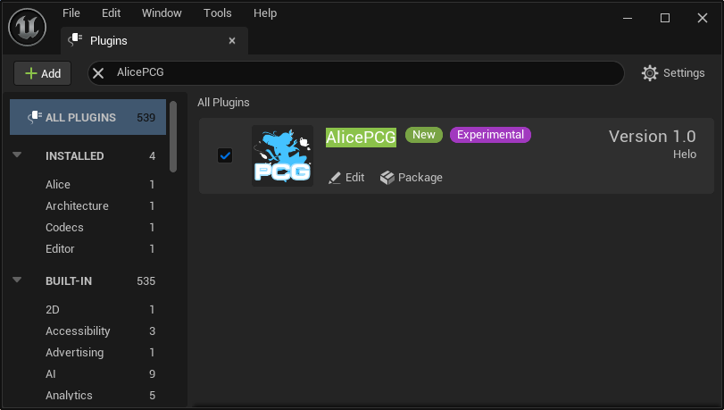<

In **Settings->Plugins**, search for **"AlicePCG"** and enable the AlicePCG plugin.

Click the **AlicePCGPanel** button on the editor interface to open the AlicePCGPanel panel.

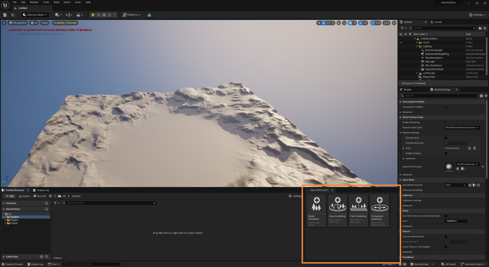

You can dock the AlicePCGPanel at any position inside the editor.

## Use AlicePCGActor 

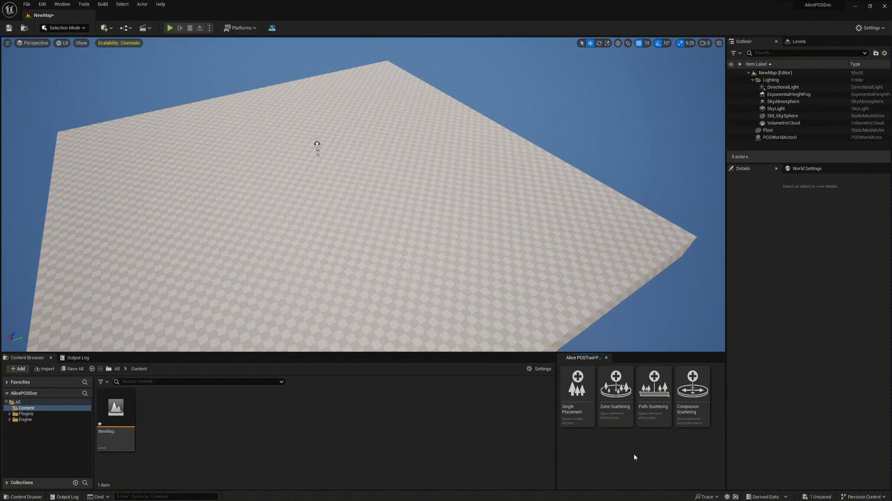

Create a new level and place an Actor that can represent basic ground. Drag and drop the **"ZoneScattering"** card onto the scene.

Each card in the AlicePCGPanel represents a type of **AlicePCGActor**. ZoneScattering is used to generate specified types of elements in a designated area.

Adjust the blue spline to determine the generation range of the ZoneScattering.

### Configure Surface Information 

Next, configure the surface information for the actors that ZoneScattering needs to identify in the scene.

Select the static mesh representing the ground and add a tag for identification. Here, let's set it to **"SurfaceTarget"**.

You can also set it to any tag name as needed.

Right-click in an empty area of the Content Browser, then select **Miscellaneous -> DataAsset**.

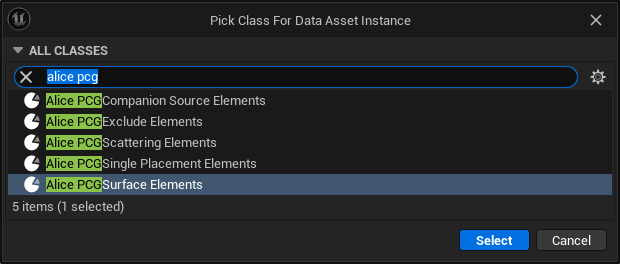

Search for **"alice pcg"**, then select the **AlicePCGSurfaceElements** type to create a SurfaceElements data asset.

Double-click to open the SurfaceElements data asset, then add an entry to the **SurfaceList** array and set it to **"SurfaceTarget"**.

When generating, AlicePCGActor will use the tags provided in the SurfaceList to determine which surfaces in the scene can act as attachment targets for the generated elements. Multiple AlicePCGActors can share one SurfaceElements data asset, saving you from reconfiguring them for each AlicePCGActors.

Here, we'll designate the static mesh representing the ground in the scene as the "ground" for ZoneScattering.

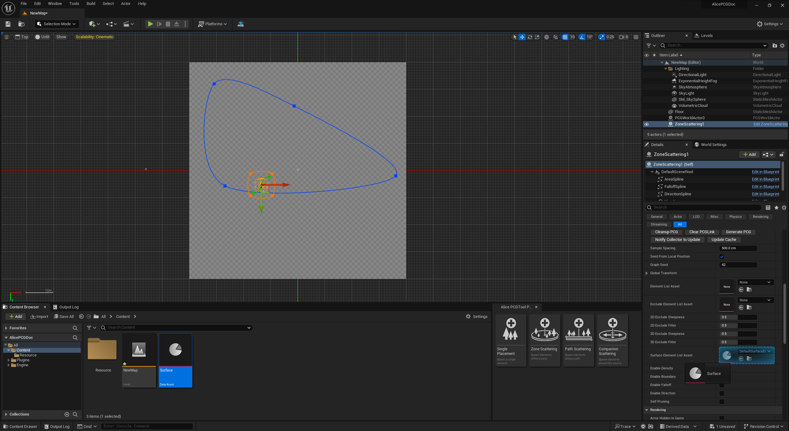

Select the ZoneScattering in the scene, then drag the SurfaceElements data asset to its **SurfaceElementListAsset** to complete the surface information configuration.

### Configure Generation Elements 

Configure the elements to be generated by ZoneScattering.

Right-click in an empty area of the Content Browser, then select **Miscellaneous -> DataAsset**.

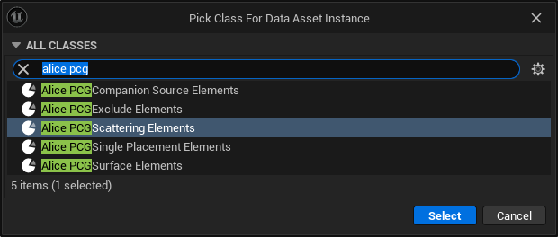

Search for **"alice pcg"**, then select the **AlicePCGScatteringElements** type to create a ScatteringElements data asset.

Double-click to open the ScatteringElements data asset, then add an entry to the **StaticMeshList** array. For the **StaticMesh** parameter, select a static mesh model.

The ScatteringElements data asset allows you to record multiple types of generation element lists. Ultimately, AlicePCGActor will convert the items in the list into InstancedStaticMesh Components or Actors generated in the scene.

The ScatteringElements data asset allows you to set unique generation behavior for each element in its list for AlicePCGActor to query and adhere to when generating elements.

Multiple AlicePCGActors can share one ScatteringElements data asset, saving you from reconfiguring them for each AlicePCGActor.

Select the ZoneScattering in the scene, then drag the ScatteringElements data asset to its **ElementListAsset** to complete the configuration of the generated elements.

Select the ZoneScattering in the scene, then adjust the **SampleSpacing** parameter to control the spacing between generated elements.

### Configure Exclusion Information 

Next, configure the exclusion information for ZoneScattering to identify in the scene.

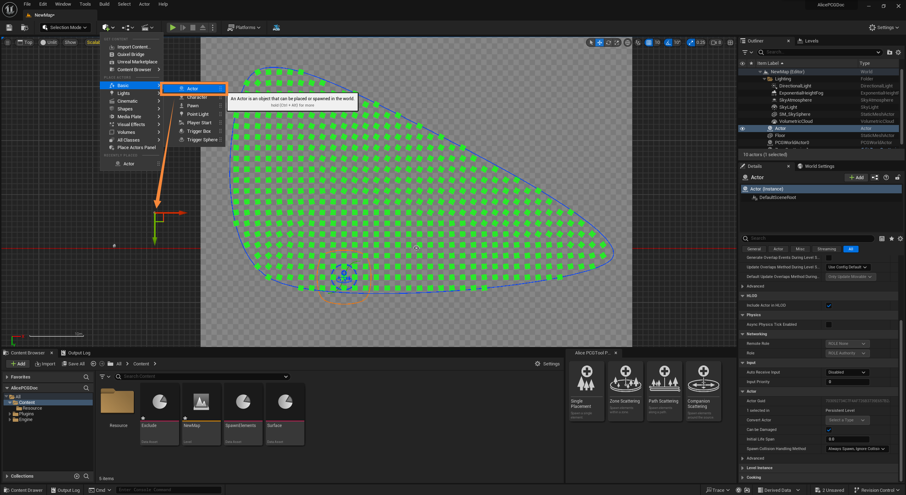

Create a new actor in the scene.

Add a tag named **"PathSplineActor"** to the created actor.

Add a spline component under the actor. Check the **ScaleVisualizationWidth** parameter of the spline component and set its value to **1**. Set the **Scale** of spline points on the spline component to **(300, 300, 300)**.

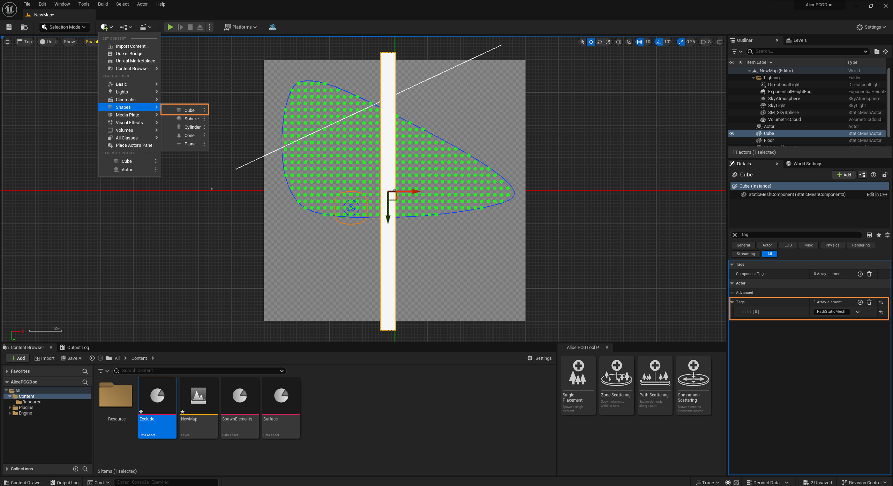

Continuing in the scene, add a Cube static mesh. Add a tag named **"PathStaticMesh"** to it. Adjust the scale of the Cube to be greater than or equal to **(2, 2, 2)**.

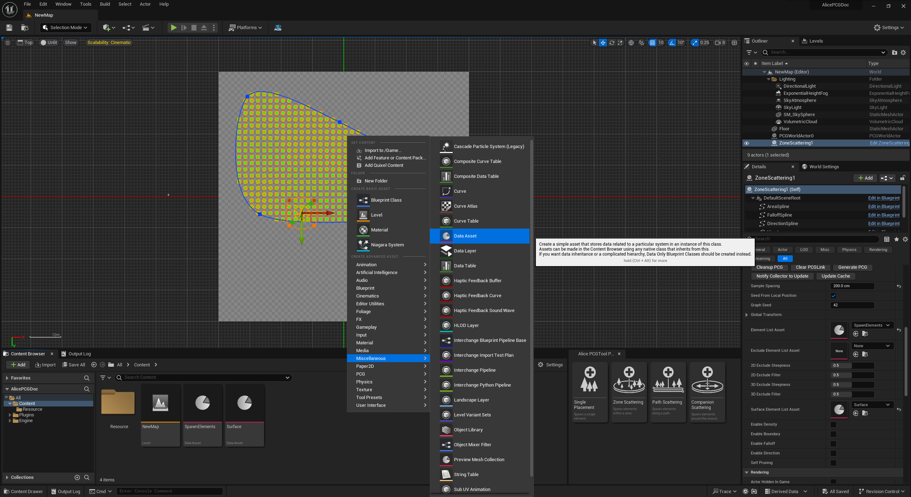

Right-click in an empty area of the Content Browser, then select **Miscellaneous -> DataAsset**.

Search for **"alice pcg"**, then select the **AlicePCGExcludeElements** type to create an ExcludeElements data asset.

Double-click to open the ExcludeElements data asset, then add an entry to the **SplineList** array. Set the **ActorTag** to **"PathSplineActor"** to record the spline actors in the scene as exclusion objects.

Add an entry to the **StaticMeshList** array. Set the **ActorTag** to **"PathStaticMesh"** and set the **ExcludeType** to **"Exclude as 2D"** to record the Cube static mesh in the scene as an exclusion object.

Previously, we scaled the Cube to be **(2, 2, 2)** or larger. This is because AlicePCGActor performs exclusion calculations by converting ExcludeElements data assets into spatial pixels when generating elements. Therefore, the conversion **precision** (the Precision parameter in the StaticMeshList entry) needs to be smaller than the actual minimum edge length of the object to allow AlicePCGActor to generate at least one spatial pixel during conversion.

ExcludeElements data assets allow recording of **Spline** / **StaticMesh** / **InstancedStaticMesh** / **PCGGeneratedOutput** / **Volume** objects in the scene. AlicePCGActor will avoid the content areas specified in the ExcludeElements data asset when generating elements.

Multiple AlicePCGActors can share a ScatteringElements data asset, saving you from reconfiguring them for each AlicePCGActor.

Select the ZoneScattering in the scene, then drag the ExcludeElements data asset to its **ExcludeElementListAsset** to complete the exclusion information configuration.

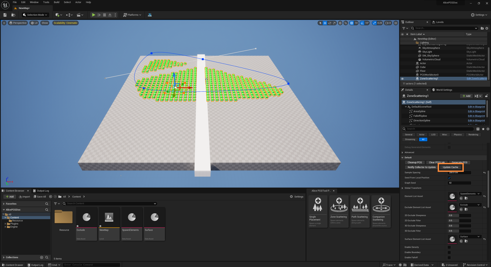

Click the **UpdateCache** button on the ZoneScattering details panel to update the exclusion information and regenerate the elements.

## Update AlicePCGActor Cache 

When there are changes to exclusion objects in the scene, clicking the **GeneratePCG** button won't apply these changes during generation by AlicePCGActor. This is because the calculation of converting exclusion objects into spatial pixels is slow. The calculated spatial pixels are cached in AlicePCGActor to prevent capturing and converting all exclusion objects from the scene each time AlicePCGActor generates elements.

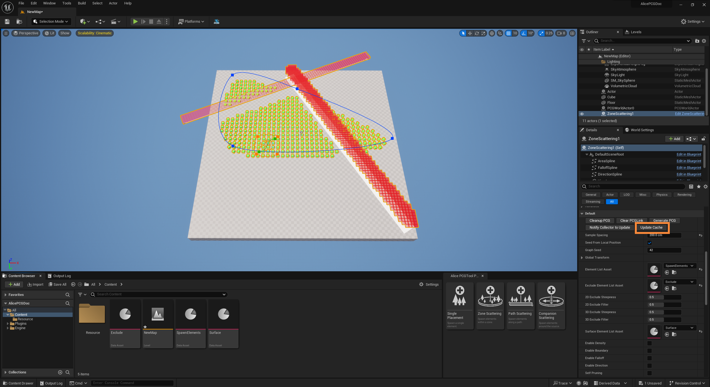

You need to use the **UpdateCache** button to update the cache in order to apply changes to exclusion objects in the scene.

## Updating the Dependent AlicePCGActor 

An object generated by one AlicePCGActor can be an exclusion object for another AlicePCGActor.

Open the ScatteringElements data asset of ZoneScattering and add a **PointTag** named **"SpawnedCube"** to the elements to be generated.

To allow other AlicePCGActors to recognize the generated InstancedStaticMesh Components or Actors, you need to add **PointTags** to the elements in the ScatteringElements data asset. When generating elements, AlicePCGActor will add the PointTags of the elements to the ComponentTags (if InstancedStaticMesh Components are generated) or Tags (if Actors are generated) of the corresponding generated objects.

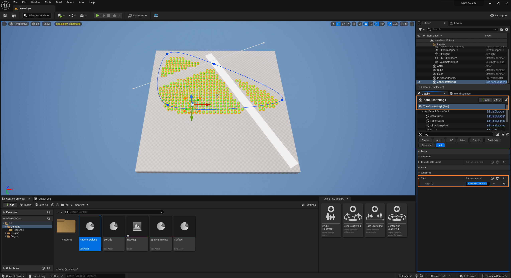

If the generated object is an InstancedStaticMesh Component, you also need to add Tags to the Actor containing the Component to accurately locate the object.

Here, add a Tag named **"SpawnedCubeActor"**.

Create another AlicePCGActor in the scene and configure its generation elements and surface information.

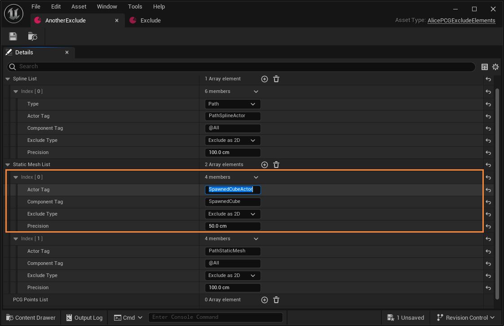

Create a new data asset of type **AlicePCGScatteringElements**. Add exclusion items under the **StaticMeshList** array. Here, set the exclusion type to **"Exclude as 2D"** and set the **precision** to **50**.

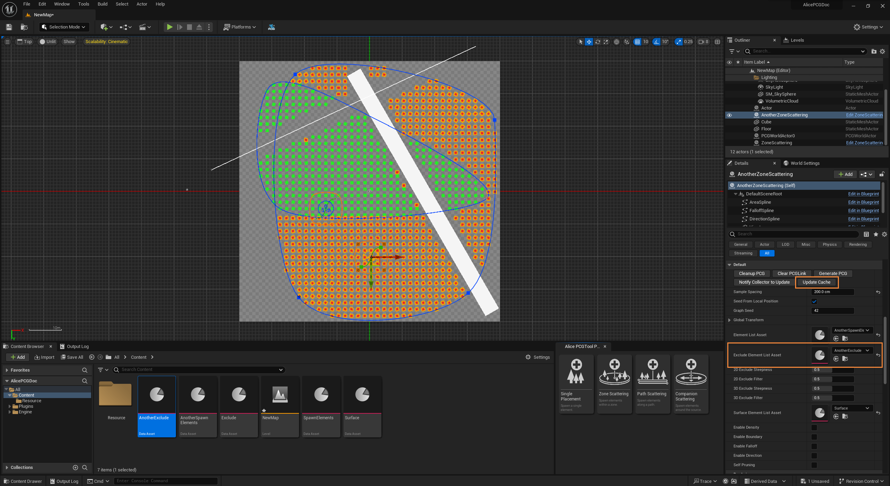

Configure the data asset that records exclusion information to the AlicePCGActor. Click the **UpdateCache** button to update the exclusion information cache. The red cubes will avoid generating near the green cubes.

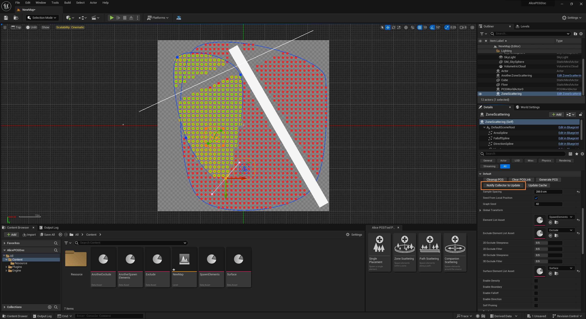

When there are changes to the AlicePCGActor generating green cubes, clicking the **NotifyCollectorToUpdate** button will notify all dependent AlicePCGActors to update and adapt to the changes.

# Detail Reference 

## AlicePCGActor Parameter 

### Generate Setting 

Generate Setting is located at the top of each AlicePCGActor parameter, controlling how AlicePCGActor generates initial source points.

Different AlicePCGActors generate source points differently, so their Generate Setting parameters also vary.

#### SinglePlacement 

SinglePlacement allows selecting one type of element from those recorded in the ElementListAsset.

- **ElementType** 
  Specifies which list from the ElementListAsset to choose elements from. There are three types of element lists: StaticMeshList, PCGAssetList, and ActorList.

- **Seed** 
  specifies the index of the element to select from the list. It will be retrieved by taking the remainder of the Seed divided by the number of elements in the list.

#### ZoneScattering 

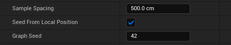

ZoneScattering uniformly generates two-dimensional grid-like source points within the specified range at regular intervals.

- **SampleSpacing** 
  Specifies the spacing between generated source points.
- **SeedFromLocalPosition** 
  If true, the PointSeed will be calculated based on the relative position of the source point in the Actor. When moving the Actor, the source points will remain relatively stable. Otherwise, the elements generated from the source points may change each time the Actor is moved.
- **GraphSeed** 
  Different values provide randomness to the AlicePCGActor.

#### PathScattering 

PathScattering uniformly generates three-dimensional grid-like source points around the specified spline with a certain number and spacing.

- **GridPointCount** 
  Number of grid-like source points generated.
- **GridPointSpacing** 
  Spacing between grid-like source points generated.
- **SeedFromLocalPosition** 
  If true, the PointSeed will be calculated based on the relative position of the source point in the Actor. When moving the Actor, the source points will remain relatively stable. Otherwise, the elements generated from the source points may change each time the Actor is moved.
- **GraphSeed** 
  Different values provide randomness to the AlicePCGActor.

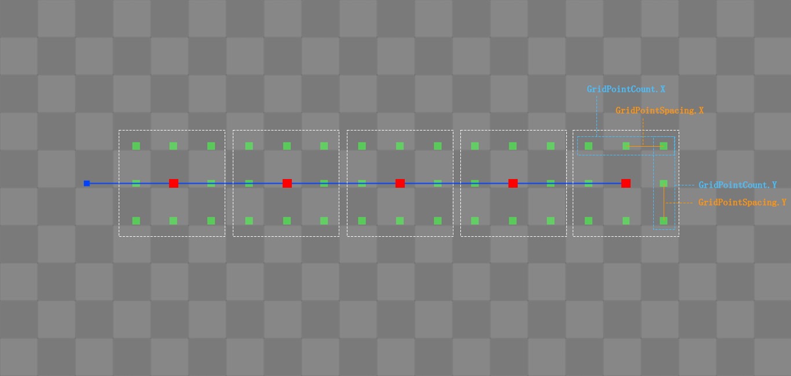

#### CompanionScattering 

CompanionScattering generates additional companion points around the specified companion source.

- **CompanionSetting** 
  Sets the way companion points are generated around the companion source.
- **GraphSeed** 
  Different values provide randomness to the AlicePCGActor.

CompanionScattering retrieves companion sources from the CompanionSourceElementListAsset. [Click here](#Companion Source Elements) to learn more.

    
    

- **CompanionType**
  Divided into Grid and Random. Grid is used to generate three-dimensional grid-like companion points around the companion source.
- **Shape**
  Choosing different shapes can generate companion points in different shapes of three-dimensional grid.

    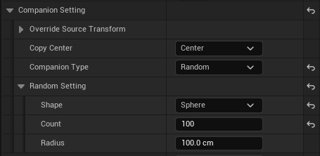
    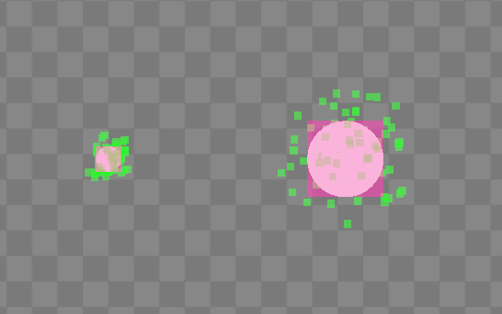

When CompanionType is set to Random, companion points will be generated at random positions within a certain space around the companion source.

    
    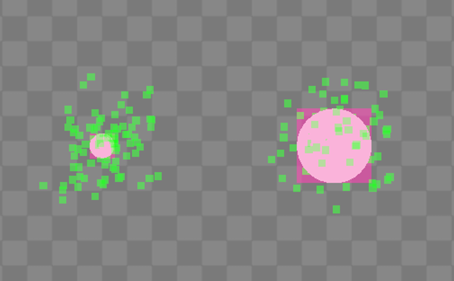

Usually, the positions of generated companion points scale with the transformation scale of the companion source. You can counteract this scaling effect brought by the companion source by using the **Absolute Scale** option in **OverrideSourceTransform**. When the Absolute Scale option is checked, the positions of companion points will no longer be affected by the scale value of the companion source.

### Global Transform 

    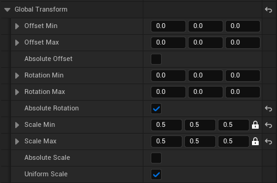
    
    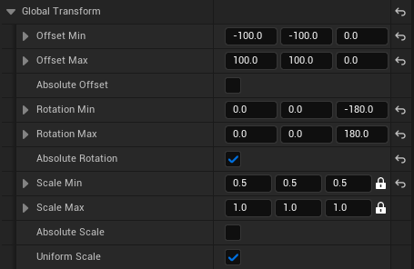
    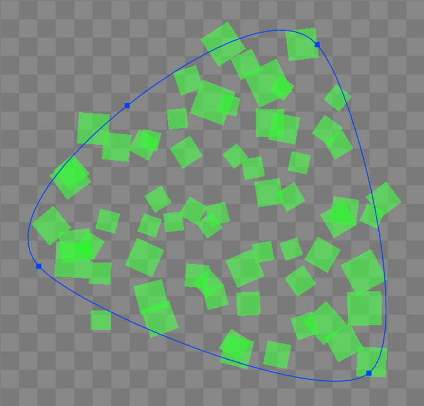

GlobalTransform is typically used to disrupt the regularity of generated source points by allowing random variations in offset, rotation, and scale values within specified ranges, resulting in a randomly distributed effect of source points in space.

### Density 

    
    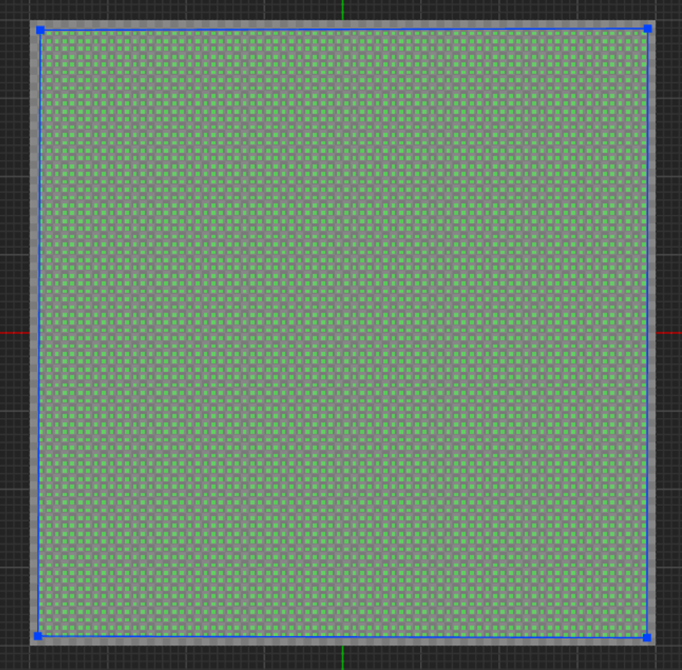
    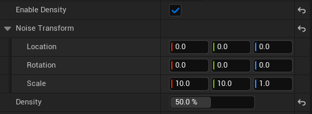
    

AlicePCGActor utilizes Perlin noise to control the density of generated elements. By controlling the transformation and density values of Perlin noise, you can control the behavior of AlicePCGActor during density culling.

Larger scale values will result in finer Perlin noise.

### Boundary 

    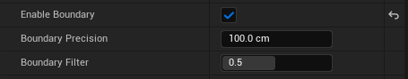
    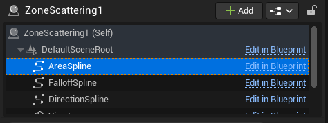

Boundary is a control parameter possessed by ZoneScattering / PathScattering / CompanionScattering. Boundary is used to control AlicePCGActor's culling of generated elements that exceed specified boundaries. The range is specified by the **AreaSpline** component in AlicePCGActor.

    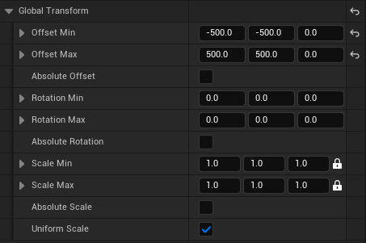
    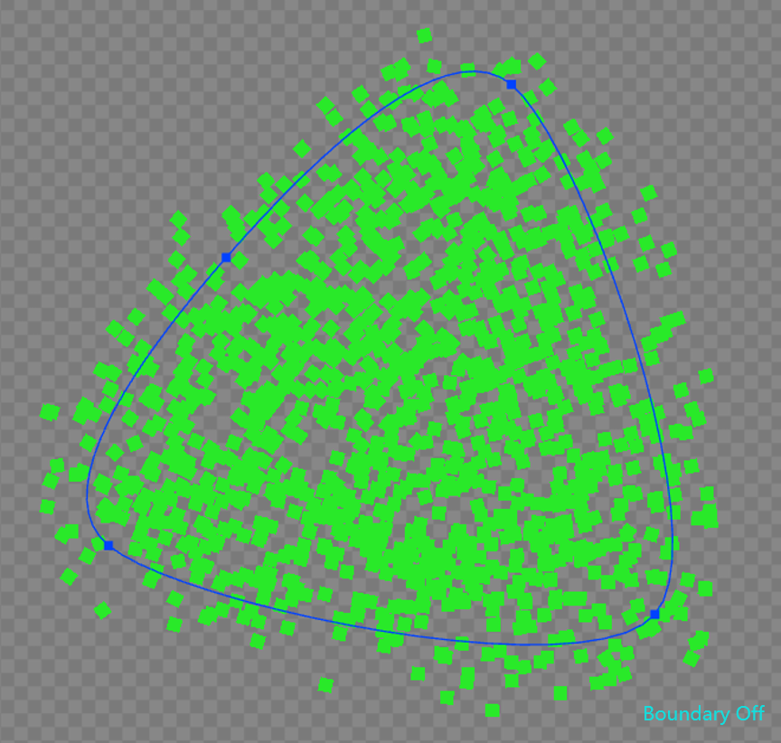
    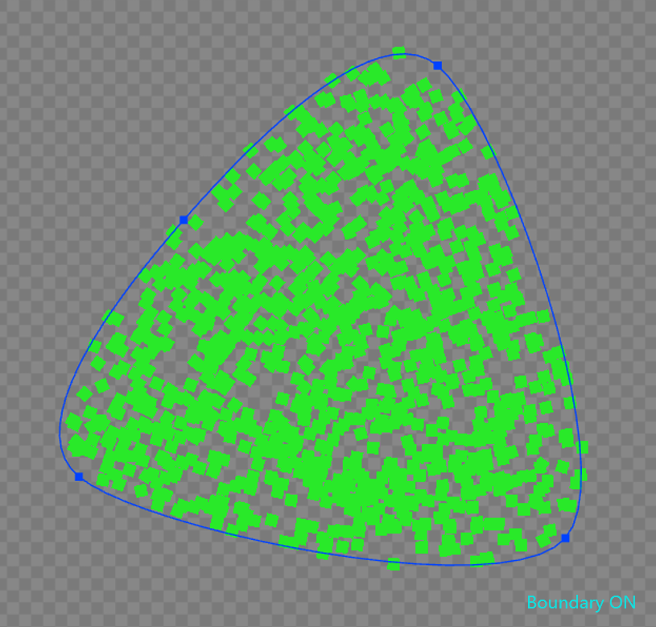

When ZoneScattering uses GlobalTransform or when the companion source of CompanionScattering exceeds the expected generation range, this control parameter is very useful. It will cull all generated elements that exceed the range of the AreaSpline spline line in AlicePCGActor.

### Falloff 

    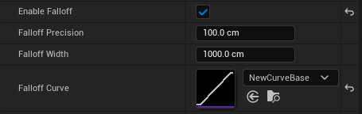
    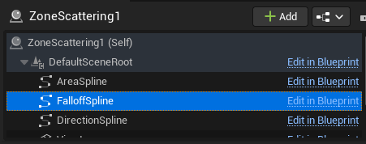

Falloff is a control parameter possessed by ZoneScattering / PathScattering / CompanionScattering. Falloff is used to adjust the overall size of generated elements by AlicePCGActor. The range is specified by the **FalloffSpline** component in AlicePCGActor.

You can add multiple spline components as FalloffSpline. When you do this, simply add the **"FalloffSpline"** component tag to the newly added spline component.

    
    

When Falloff is enabled, each element will obtain a Falloff value based on its distance from the FalloffSpline. Elements within the range of the FalloffSpline will have an initial Falloff value of **0**, while elements farther away from the FalloffSpline area will gradually transition to **1** based on the **FalloffWidth**.

By default, the Falloff value of an element will be equal to its relative scale value. You can remap the Falloff value to the element's relative scale value using **FalloffCurve**.

If the edges of the FalloffSpline change drastically and closely, smaller **FalloffPrecision** values will result in more precise sampling. However, if the edges of the FalloffSpline change smoothly, you can increase the value of FalloffPrecision appropriately to achieve better runtime efficiency.

### Direction 

    
    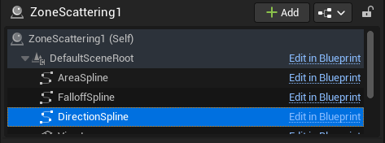

Direction is a control parameter possessed by ZoneScattering / CompanionScattering. Direction is used to adjust the rotation of generated elements by AlicePCGActor. The range and direction are specified by the **DirectionSpline** component in AlicePCGActor.

You can add multiple spline components as DirectionSpline. When you do this, simply add the **"DirectionSpline"** component tag to the newly added spline component.

    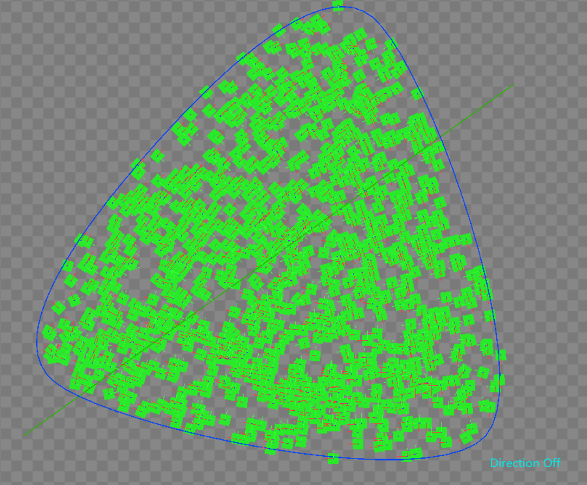
    

When Direction is enabled, elements within the **DirectionWidth** range will be forced to face the direction of the DirectionSpline.

## Elements 

AlicePCG uses Elements to store the list of elements that need to be generated.

Currently, AlicePCGActor uses two types of Elements:

- SinglePlacement uses Elements of type **AlicePCGSinglePlacementElements**.
- ZoneScattering, PathScattering, CompanionScattering use Elements of type **AlicePCGScatteringElements**.

### Weight 

    
    

Weight values are used to control the proportion of elements in generation.

Weight values are integers. In the example above, the total sum of weight values is 5, where the number of red cubes generated accounts for 1/5 of the overall generation quantity.

### Slope 

    
    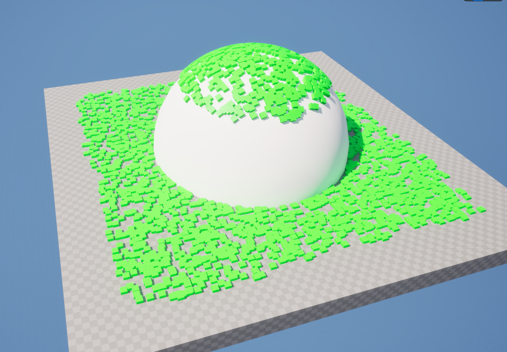

Slope value is used to specify the surface slope on which elements can land and stay when they descend. A slope of 0 indicates a completely flat upward-facing surface, while a slope of 90 indicates a completely vertical surface.

### Transform 

Each element can have its own independent transformation, allowing for relative transformations with respect to GlobalTransform or setting transformations completely independent of GlobalTransform.

This is useful for pre-set object clusters where you can set individual transformation properties for each element in the cluster.

### PointTag 

    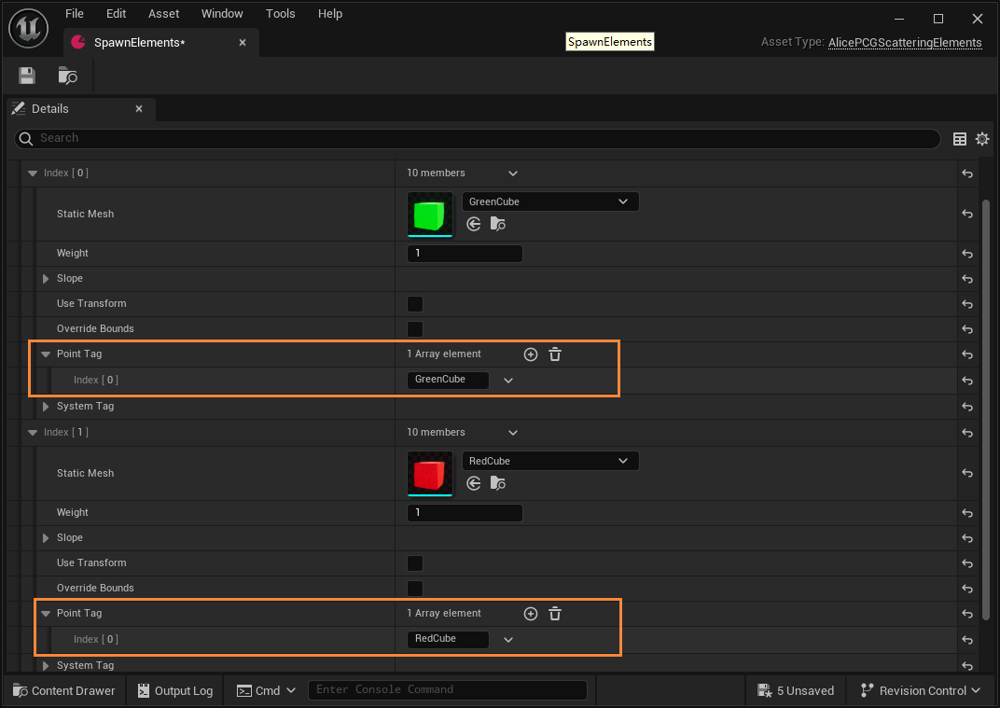
    
    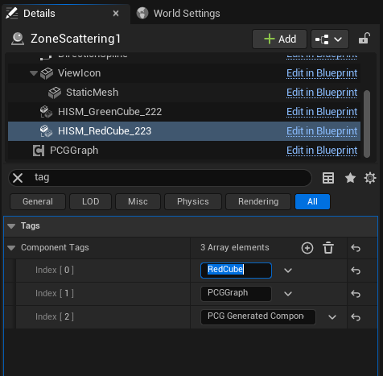

PointTag is used by AlicePCGActor to add tags to elements during generation, making it easier for other AlicePCGActors to select them.

If the generated element is an InstancedStaticMesh Component, the PointTag will be added to the Component tags. If the generated element is an Actor, the PointTag will be added to the Actor tags.

### SystemTag 

SystemTag is used to control the generation behavior of AlicePCGActor during element generation.

| System-Tag      | Notes                                                        |
| --------------- | ------------------------------------------------------------ |
| KeepVertical    | Keeps the element vertical when landing on surfaces.         |
| KeepSize        | Ignores size changes during generation of the element.       |
| RotZ            | Applies random rotation around the Z-axis during generation of the element. |
| OffsetZ         | Applies Z-axis transformation when the element lands on a surface. |
| Clutter         | Marks the element as clutter, with a 20% chance of being ignored during generation. |
| Collider        | The element has a collision volume during generation.        |
| Floater         | Keeps the element at its generated position and prevents it from landing on surfaces. |
| RotZ-Flip       | Applies a random 180° rotation around the Z-axis during generation. |
| RotZ-Orthogonal | Applies a random 90, 180, or 270° rotation around the Z-axis during generation. |
| MirrorX         | Applies a random -1 scale on the X-axis during generation.   |
| MirrorY         | Applies a random -1 scale on the Y-axis during generation.   |
| MirrorZ         | Applies a random -1 scale on the Z-axis during generation.   |

The SystemTag is also effective for PCGAsset. To add a SystemTag to an object in PCGAsset, simply add the corresponding tag to its ActorTag in its level.

### OverrideAssetElement 

For items where PCGAsset serves as the generating elements, besides the regular element parameters, you can also override certain elements' parameters from within PCGAsset externally. This is because PCGAsset typically comprises a collection of multiple elements.

OverrideAssetElement locates corresponding elements within PCGAsset using ActorTag and overrides their element parameters.

The override action for the same parameter of the same internal element within the same PCGAsset can only be executed once. For example, if an internal element of PCGAsset has both "Flower" and "Foliage" tags, and you perform overrides for both "Flower" and "Foliage" in OverrideAssetElementSlope, only the setting that appears earlier in the list will take effect on that internal element.

**Generally, it's not advisable to utilize OverrideAssetElement to implement overly complex logic, especially concerning SystemTag, as this can make your project resources opaque and difficult to manage. When adjustments to PCGAsset are necessary, the better approach is to create a new PCGAsset. OverrideAssetElement should always be treated as a fallback option or used for quickly previewing adjustments to PCGAsset content.**

## Exclude Elements  (*Cache Data) 

AlicePCG utilizes Exclude Elements to store a list of scene objects that need to be converted into excluded spatial pixels.

The data type for Exclude Elements is **AlicePCGExcludeElements**.

AlicePCGActor allows various types of scene objects to be converted into excluded spatial pixels. Currently, the supported types include:

- Spline Component
- StaticMesh Component
- InstancedStaticMesh Component
- PCG Generated output
- Volume

AlicePCGActor caches the data converted from Exclude Elements internally. When there are changes to the scene objects recorded in Exclude Elements or changes in the entries of Exclude Elements itself, you need to update the cache by clicking the **UpdateCache** button on the AlicePCGActor.

### Spline List 

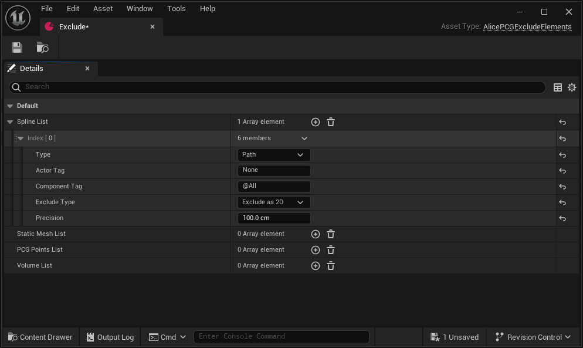

AlicePCGActor iterates through the SplineList in Exclude Elements, searching for Actors in the scene with corresponding tags, and then looks for SplineComponents within those Actors that also have matching tags. It converts them into excluded spatial pixels.

- **Type:** AlicePCGActor allows treating SplineComponent as either a path or an area.
- **ActorTag:** AlicePCGActor searches for Actors in the scene with the corresponding tag and looks for the specified SplineComponent within those Actors' components.
- **ComponentTag:** AlicePCGActor looks for SplineComponents with corresponding tags within the found Actors. If set to "@All", it collects all SplineComponents in the Actor.
- ExcludeType
  - **Exclude as 2D:** Treats the generated excluded spatial pixels as a 2D area. During element exclusion calculation, all elements within this area on the XY plane are considered for deletion.
  - **Exclude as 3D:** Treats the generated excluded spatial pixels as a 3D area. During element exclusion calculation, only elements within this area in 3D space are considered for deletion.
- **Precision:** Specifies the size precision of the converted spatial pixels. It's advisable to increase this value as much as possible. Smaller precision values create denser spatial pixels but also exponentially increase the conversion time for spatial pixels.

### StaticMesh List 

AlicePCGActor traverses the StaticMeshList in Exclude Elements, searching for Actors in the scene with corresponding tags, and then looks for (Instanced)StaticMeshComponents within those Actors that also have matching tags. It converts them into excluded spatial pixels.

- **ActorTag:** AlicePCGActor searches for Actors in the scene with the corresponding tag and looks for the specified (Instanced)StaticMeshComponent within those Actors' components.
- **ComponentTag:** AlicePCGActor looks for (Instanced)StaticMeshComponents with corresponding tags within the found Actors. If set to "@All", it collects all (Instanced)StaticMeshComponents in the Actor.
- **ExcludeType**
  - **Exclude as 2D:** Treats the generated excluded space pixels as a 2D area. During element exclusion calculation, all elements within this area on the XY plane are considered for deletion.
  - **Exclude as 3D:** Treats the generated excluded space pixels as a 3D area. During element exclusion calculation, only elements within this area in 3D space are considered for deletion.
- **Precision:** Specifies the size precision of the converted space pixels. It's advisable to increase this value as much as possible. Smaller precision values create denser space pixels but also exponentially increase the conversion time for space pixels.

### PCG Points List 

AlicePCGActor traverses the PCGPointsList in Exclude Elements, searching for Actors in the scene with corresponding tags, and then looks for PCGGraphComponents within those Actors that also have matching tags. It converts specified points from the PCG Generated Output of those PCGGraphComponents into excluded spatial pixels.

- **ActorTag:** AlicePCGActor searches for Actors in the scene with the corresponding tag and looks for the specified PCGGraphComponent within those Actors' components.
- **ComponentTag:** AlicePCGActor looks for PCGGraphComponents with corresponding tags within the found Actors. If set to "@All", it collects all PCG Graph Components in the Actor.
- **PointTag:** AlicePCGActor searches for points with corresponding tags in the PCGGeneratedOutput of the found PCGGraphComponent.
- **ExcludeType**
  - **Exclude as 2D:** Treats the generated excluded space pixels as a 2D area. During element exclusion calculation, all elements within this area on the XY plane are considered for deletion.
  - **Exclude as 3D:** Treats the generated excluded space pixels as a 3D area. During element exclusion calculation, only elements within this area in 3D space are considered for deletion.

### Volume List 

AlicePCGActor traverses the VolumeList in Exclude Elements, searching for volumes in the scene with corresponding tags, and converts them into excluded spatial pixels.

- **ActorTag:** AlicePCGActor searches for volumes in the scene with the corresponding tag.
- **ExcludeType**
  - **Exclude as 2D:** Treats the generated excluded space pixels as a 2D area. During element exclusion calculation, all elements within this area on the XY plane are considered for deletion.
  - **Exclude as 3D:** Treats the generated excluded space pixels as a 3D area. During element exclusion calculation, only elements within this area in 3D space are considered for deletion.
- **Precision:** Specifies the size precision of the converted space pixels. It's advisable to increase this value as much as possible. Smaller precision values create denser space pixels but also exponentially increase the conversion time for space pixels.

## Surface Elements 

AlicePCG uses Surface Elements to store a list of scene objects that generated elements can reach the surface of.

The data type for Surface Elements is **AlicePCGSurfaceElements**.

- **RaySetting:** Used for ray detection settings.
  - **RayOrigin:** The origin point of the detection ray.
  - **RayDirection:** The direction of the detection ray.
  - **RayLength:** The length of the detection ray.
- **FilterType:** Filter type for the SurfaceList.
  - **Include:** Only objects listed in the SurfaceList can be considered as surface objects.
  - **Exclude:** Objects listed in the SurfaceList cannot be considered as surface objects.
- **SurfaceList:** Actors in the scene with tags appearing in this list will be detected.

## Companion Source Elements (*Cache Data)   

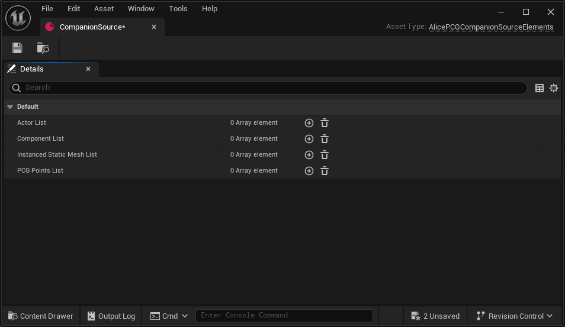

CompanionScattering uses Companion Source Elements to store a list of scene objects that need to be converted into companion sources.

The data type for Companion Source Elements is **AlicePCGCompanionSourceElements**.

CompanionScattering allows various types of scene objects to be converted into companion sources. Currently, the supported types include:

- Any Actor in the scene
- Components under any Actor in the scene
- InstancedStaticMesh Component
- PCG Generated output

CompanionScattering caches the data converted from Companion Source Elements internally. When there are changes to the scene objects recorded in Companion Source Elements or changes in the entries of Companion Source Elements itself, you need to update the cache by clicking the **UpdateCache** button on the AlicePCGActor.

### Actor List 

CompanionScattering traverses the ActorList in Companion Source Elements, searching for Actors in the scene with corresponding tags, and converts their transformation information into companion sources.

- **ActorTag:** CompanionScattering searches for Actors in the scene with the corresponding tag.

### Component List 

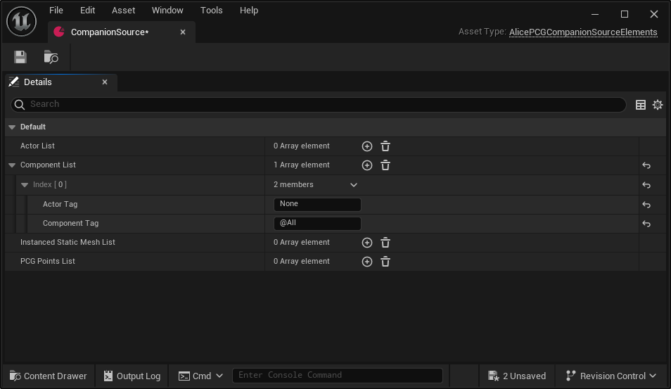

CompanionScattering traverses the ComponentList in Companion Source Elements, searching for Actors in the scene with corresponding tags, and then looks for Components within those Actors that also have matching tags, converting their transformation information into companion sources.

- **ActorTag:** CompanionScattering searches for Actors in the scene with the corresponding tag and looks for the specified Component within those Actors' components.
- **ComponentTag:** CompanionScattering looks for Components with corresponding tags within the found Actors. If set to "@All", it collects all Components in the Actor.

### Instanced Static Mesh List 

CompanionScattering traverses the InstancedStaticMeshList in Companion Source Elements, searching for Actors in the scene with corresponding tags, and then looks for InstancedStaticMeshComponents within those Actors that also have matching tags, converting their instances' transformation information into companion sources.

- **ActorTag:** CompanionScattering searches for Actors in the scene with the corresponding tag and looks for the specified InstancedStaticMeshComponent within those Actors' components.
- **ComponentTag:** CompanionScattering looks for InstancedStaticMeshComponents with corresponding tags within the found Actors. If set to "@All", it collects all InstancedStaticMeshComponents in the Actor.

### PCG Points List 

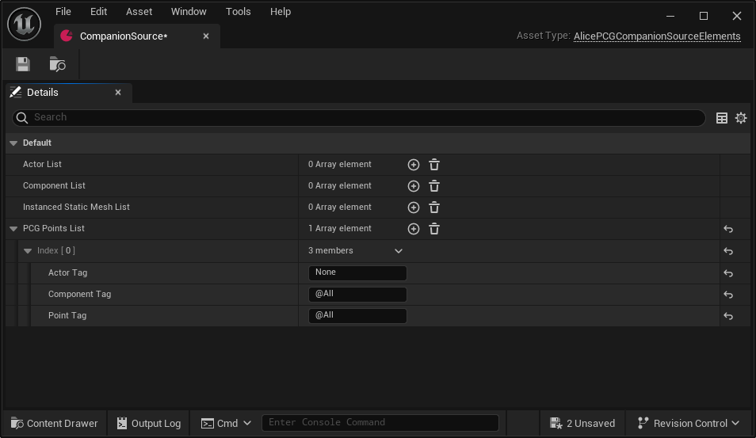

CompanionScattering traverses the PCGPointsList in Companion Source Elements, searching for Actors in the scene with corresponding tags, and then looks for PCGGraphComponents within those Actors that also have matching tags, converting their instances' transformation information into companion sources.

- **ActorTag:** CompanionScattering searches for Actors in the scene with the corresponding tag and looks for the specified PCGGraphComponent within those Actors' components.
- **ComponentTag:** CompanionScattering looks for PCGGraphComponents with corresponding tags within the found Actors. If set to "@All", it collects all PCGGraphComponents in the Actor.
- **PointTag:** CompanionScattering searches for points with corresponding tags in the PCGGeneratedOutput of the found PCGGraphComponent.

# Debug 

## General Debug 

### Count 

#### Source Points Count 

Source points count displays the current number of points initially generated by AlicePCGActor.

#### Final Points Count 

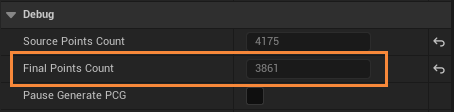

Final points count displays the current number of elements finally generated by AlicePCGActor after a series of processing.

#### Companion Source Points Count 

Companion source points count displays the number of companion source points recorded by CompanionScattering.

#### Companion Points Count 

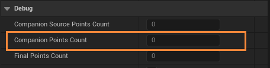

Companion points count displays the number of companion points generated by CompanionScattering.

### Pause Generate PCG 

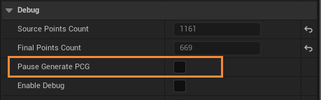

PCG auto-rebuild disabled.

This option is useful when modifying parameters of AlicePCGActor to handle large amounts of data.

### Debug Source Points 

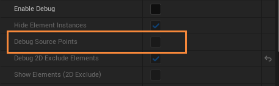

Enable Debug Source Points will display the points initially generated by AlicePCGActor.

### Exclude Debug 

Exclude debugging enabled will display the excluded space pixels cached by AlicePCGActor.

### Falloff Debug 

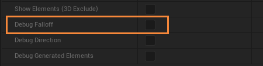

Falloff debugging enabled will display the brightness of elements based on their Falloff value.

### Direction Debug 

Direction debugging enabled will display the Gizmo for each element.

### Generated Elements Debug 

Generation result debugging enabled will display the Bounds of the elements finally generated by AlicePCGActor.

## Advanced Debug 

The Advanced Debugging Panel records detailed dependency data of AlicePCGActor to provide more detailed debugging data in case of unexpected behavior.

| Item                              | Notes                                                        |
| --------------------------------- | ------------------------------------------------------------ |
| Exclude Dependencies              | Records scene objects that have been converted to excluded space pixels by this AlicePCGActor. |
| Exclude PCG Dependencies          | Records other AlicePCGActor objects whose generated content has been converted to excluded space pixels by this AlicePCGActor. This data is used to organize AlicePCG dependency chains. |
| Surface Dependencies              | Records scene objects identified by this AlicePCGActor as surfaces for detection. |
| Surface PCG Dependencies          | Records other AlicePCGActor objects whose generated content has been identified as surfaces for detection by this AlicePCGActor. This data is used to organize AlicePCG dependency chains. |
| Companion Source Dependencies     | Records scene objects that have been converted to companion sources by this AlicePCGActor. |
| Companion Source PCG Dependencies | Records other AlicePCGActor objects whose generated content has been converted to companion sources by this AlicePCGActor. This data is used to organize AlicePCG dependency chains. |
| Exclude Data Cache                | Records the excluded space pixel data cached by this AlicePCGActor. |
| Companion Source Data Cache       | Records the companion source data cached by this AlicePCGActor. |

# Implicit Restrictions 

## Transactions 

### Copying 

The PCG plugin on which AlicePCG depends is still in an imperfect development stage. Any behavior of copying AlicePCGActor via Alt + drag will lead to unpredictable issues.

If you encounter any problems where PCG-generated content cannot be updated due to dragging and copying, please delete all internal components generated by AlicePCGActor and then update the cache or generate PCG again.

### Undo 

The PCG plugin on which AlicePCG depends is still in an imperfect development stage. Any behavior of undoing changes to AlicePCGActor via Ctrl + Z will lead to unpredictable issues.

**Please refrain from using the undo function on PCG content, as this may cause crashes to the PCG system or Unreal Engine Editor.**

## Loop Detected 

When a single AlicePCGActor processes a large amount of data, due to the loop count limitation of Unreal Engine Editor, data processing may fail, and you may not see any content generated by AlicePCGActor.

Additionally, viewing logs may receive warnings like the following:

To address this issue, you need to increase the allowed loop count in the project settings. You can do this by following these steps:

1. Go to **Edit -> Project Settings**.
2. Find the setting named **MaximumLoopIterationCount**.
3. Modify its value to a larger number to allow for more loop iterations.

