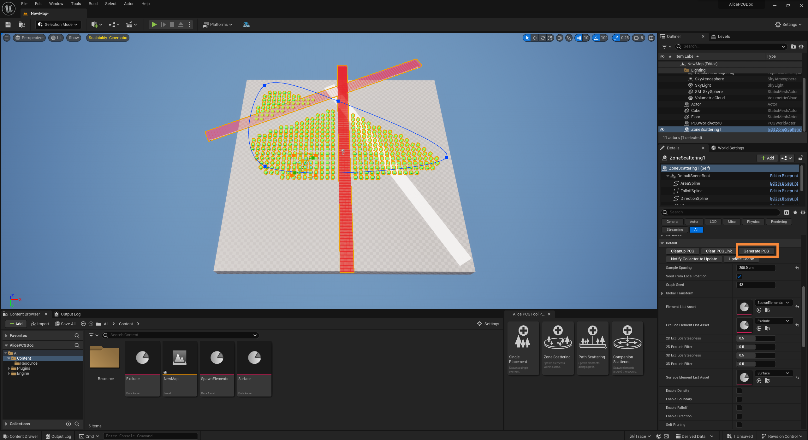
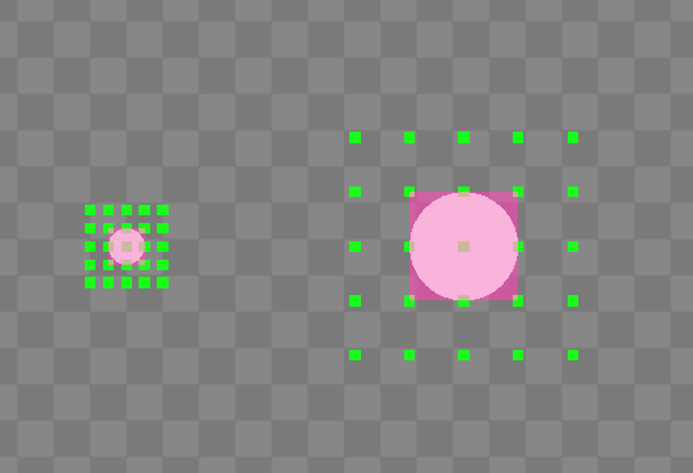

[TOC]

[**快速入门**](#快速入门)

[**+ 启用AlicePCG**](#启用AlicePCG)

[**+ 使用AlicePCGActor**](#使用AlicePCGActor)

[++ 配置表面信息](#配置表面信息)

[++ 配置生成元素](#配置生成元素)

[++ 配置排除信息](#配置排除信息)

[**+ 更新AlicePCGActor缓存**](#更新AlicePCGActor缓存)

[**+ 更新依赖的AlicePCGActor**](#更新依赖的AlicePCGActor)

[**详细参考**](#详细参考)

[**+ AlicePCGActor Parameter**](#AlicePCGActorParameter)

[++ Generate Setting](#GenerateSetting)

[+++ SinglePlacement](#SinglePlacement)

[+++ ZoneScattering](#ZoneScattering)

[+++ PathScattering](#PathScattering)

[+++ CompanionScattering](#CompanionScattering)

[++ Global Transform](#GlobalTransform)

[++ Density](#Density)

[++ Boundary](#Boundary)

[++ Falloff](#Falloff)

[++ Direction](#Direction)

[**+ Elements**](#Elements)

[++ Weight](#Weight)

[++ Slope](#Slope)

[++ Transform](#Transform)

[++ PointTag](#PointTag)

[++ SystemTag](#SystemTag)

[++ OverrideAssetElement](#OverrideAssetElement)

[**+ Exclude Elements (*Cache Data)**](#ExcludeElements)

[++ Spline List](#SplineList)

[++ StaticMesh List](#StaticMeshList)

[++ PCG Points List](#PCGPointsList)

[++ Volume List](#VolumeList)

[**+ Surface Elements**](#SurfaceElements)

[**+ Companion Source Elements (*Cache Data)**](#CompanionSourceElements)

[++ Actor List](#ActorList)

[++ Component List](#ComponentList)

[++ Instanced Static Mesh List](#InstancedStaticMeshList)

[++ PCG Points List](#PCGPointsList)

[**调试**](#调试)

[**+ 一般调试**](#一般调试)

[++ 计数](#计数)

[+++ 源点计数](#源点计数)

[+++ 最终点计数](#最终点计数)

[+++ 伴生源计数](#伴生源计数)

[+++ 伴生点计数](#伴生点计数)

[++ 暂停PCG生成](#暂停PCG生成)

[++ 源调试](#源调试)

[++ Exclude调试](#Exclude调试)

[++ Falloff调试](#Falloff调试)

[++ Direction调试](#Direction调试)

[++ 生成结果调试](#生成结果调试)

[**+ 高级调试**](#高级调试)

[**隐含限制**](#隐含限制)

[**+ 事务**](#事务)

[++ 复制](#复制)

[++ 撤销](#撤销)

[**+ 循环失控**](#循环失控)

# 快速入门 

## 启用AlicePCG 

<

在 **Settings->Plugins** 中搜索**“AlicePCG”**，启用 AlicePCG 插件。

点击编辑器界面上的 AlicePCGPanel 按钮以打开 AlicePCGPanel 面板。

可以将 AlicePCGPanel 停靠在编辑器内的任意位置。

## 使用AlicePCGActor 

新建关卡，放置一个可以表示基础地面的物体，将 **“ZoneScattering”** 卡片拖拽并放置到场景中。

AlicePCGPanel 中的每一张卡片，都代表一种类型的 **AlicePCGActor**。ZoneScattering 用于在指定的范围内批量生成指定类型的元素。

调整蓝色样条线，以确定 ZoneScattering 的生成范围。

### 配置表面信息 

接下来为 ZoneScattering 配置在场景中需要识别到的物体表面信息。

选择用于表示地面的静态网格体，为其添加一个用于识别的Tag，这里将其设置为 **“SurfaceTarget”**。

您也可以按照需要将其设置为任意的Tag名称。

在内容浏览器的空白处单击鼠标右键，选择 **Miscellaneous->DataAsset**

搜索 **“alice pcg”** ，选择 **AlicePCGSurfaceElements** 类型，来创建一个 SurfaceElements 数据资产。

双击打开 SurfaceElements 数据资产，为 **SurfaceList** 数组添加一个条目，将其设置为 **“SurfaceTarget”**。

AlicePCGActor 在生成时，会根据 SurfaceList 中提供的 Tag，确定场景中的哪些表面可以作为生成元素的吸附目标。
多个 AlicePCGActor 可以共享一个 SurfaceElements 数据资产，这样您就不必为每一个 AlicePCGActor 来重新配置它们。

这里我们将场景中用于表示地面的静态网格体作为 ZoneScattering 的“地面”。

选择场景中的 ZoneScattering，将 SurfaceElements 数据资产拖拽给它的 **SurfaceElementListAsset** 完成表面信息配置。

### 配置生成元素 

为 ZoneScattering 配置要生成的元素。

在内容浏览器的空白处单击鼠标右键，选择 **Miscellaneous->DataAsset**

搜索 **“alice pcg”** ，选择 **AlicePCGScatteringElements** 类型，来创建一个 ScatteringElements 数据资产。

双击打开 ScatteringElements 数据资产，为 **StaticMeshList** 数组添加一个条目，在 **StaticMesh** 参数上为其选择一个静态网格体模型。

ScatteringElements 数据资产允许记录多种类型的生成元素清单，最终 AlicePCGActor 会将清单中的项目转换为 InstancedStaticMesh Component 或者 Actor 生成在场景中。

ScatteringElements 数据资产允许为其清单中的每个元素设置独特的生成行为，以供 AlicePCGActor 在生成元素时进行查询和遵守。

多个 AlicePCGActor 可以共享一个 ScatteringElements 数据资产，这样您就不必为每一个 AlicePCGActor 来重新配置它们。

选择场景中的 ZoneScattering，将 ScatteringElements 数据资产拖拽给它的 **ElementListAsset** 完成生成元素配置。

选择场景中的 ZoneScattering，调整 **SampleSpacing** 参数，以控制元素之间的生成间距。

### 配置排除信息 

接下来为 ZoneScattering 配置在场景中需要识别到的排除信息。

在场景中创建一个新 Actor。

为创建好的 Actor 添加名为 **“PathSplineActor”** 的 Tag。

在 Actor 下添加一个 Spline 组件，勾选 Spline 组件的 **ScaleVisualizationWidth** 参数并将值设置为 **1**。将 Spline 组件上的样条点 **Scale** 设置为**（300, 300, 300）**。

继续在场景中添加一个 Cube 静态网格体，为其添加名为 **“PathStaticMesh”** 的 Tag。****调整 Cube 的 **Scale** 值为**（2, 2, 2）**以上。

在内容浏览器的空白处单击鼠标右键，选择 **Miscellaneous->DataAsset**

搜索 **“alice pcg”** ，选择 **AlicePCGExcludeElements** 类型，来创建一个 ExcludeElements 数据资产。

双击打开 ExcludeElements 数据资产，为 **SplineList** 数组添加一个条目，将 **ActorTag** 设置为 **“PathSplineActor”**，用于将场景中的 Spline 演员记录为排除对象。

为 **StaticMeshList** 数组添加一个条目，将 **ActorTag** 设置为 **“PathStaticMesh”**，将 **ExcludeType** 设置为 **“Exclude as 2D”**，用于将场景中的 Cube 静态网格体记录为排除对象。

此前，我们将 Cube 的 **Scale** 值为**（2, 2, 2）**以上，这是因为 AlicePCGActor通过将  ExcludeElements 数据资产转换为空间像素来执行生成元素时的排除计算。因此，转换**精度**（StaticMeshList条目中的Precision参数）需要小于物体的实际最小边长，以允许 AlicePCGActor 在转换时至少能够生成一个空间像素。

ExcludeElements 数据资产允许记录场景中的 Spline / StaticMesh / InstancedStaticMesh / PCGGeneratedOutput / Volume，AlicePCGActor 在生成元素时，将避开 ExcludeElements 数据资产中指定的内容区域。

多个 AlicePCGActor 可以共享一个 ScatteringElements 数据资产，这样您就不必为每一个 AlicePCGActor 来重新配置它们。

选择场景中的 ZoneScattering，将 ExcludeElements 数据资产拖拽给它的 **ExcludeElementListAsset** 完成排除信息配置。

点击 ZoneScattering 细节面板上的 UpdateCache 按钮，更新排除信息，并重新生成元素。

## 更新AlicePCGActor缓存 

当场景中的排除对象发生变化时，点击 **GeneratePCG** 按钮不会让 AlicePCGActor 在生成时应用排除对象变化。这是因为将排除对象转换为空间像素的计算是缓慢的，计算的空间像素在 AlicePCGActor 中被缓存，以防止每一次 AlicePCGActor 生成元素时重新从场景中捕获并转换所有排除对象。

您需要通过 **UpdateCache** 按钮来更新缓存，以应用场景中排除对象的变化。

## 更新依赖的AlicePCGActor 

一个 AlicePCGActor 所生成的场景对象，可以是另一个 AlicePCGActor 的排除对象。

打开 ZoneScattering 的 ScatteringElements 数据资产，为要生成的元素添加一个名为 **“SpawnedCube”** 的 **PointTag**。

为了让其他的 AlicePCGActor 能够识别到生成的 InstancedStaticMesh Component 或者 Actor，您需要在 ScatteringElements 数据资产中为元素添加 **PointTag**。AlicePCGActor 在生成元素时，会将元素具有的 PointTag 添加到对应生成对象的 ComponentTags（如果生成的是 InstancedStaticMesh Component）或者 Tags（如果生成的是 Actor）。

如果生成的对象是一个 InstancedStaticMesh Component，则还需要为 Component 所在的 Actor 添加一个 Tags，以便能够准确地找到该对象。

这里添加了一个名为 **“SpawnedCubeActor”** 的Tag。

在场景中创建另一个 AlicePCGActor，并为其配置生成元素和表面信息。

创建一个 **AlicePCGScatteringElements** 类型的新的数据资产，在 **StaticMeshList** 数组下添加排除项目。这里我们将排除类型设置为 **“Exclude as 2D”**，将**精度**设置为 **50**。

将记载排除信息的数据资产配置到 AlicePCGActor，点击 **UpdateCache** 按钮更新排除信息缓存，红色方块将避开绿色方块进行生成。

此时，当生成绿色方块的 AlicePCGActor 发生改变后，点击 **NotifyCollectorToUpdate** 按钮，AlicePCGActor 将通知所有正在依赖它的 AlicePCGActor 进行更新，以适配发生的更改。

# 详细参考 

## AlicePCGActor Parameter 

### Generate Setting 

Generate Setting 在每个 AlicePCGActor 参数的最上方，它们控制 AlicePCGActor 如何生成初始的源点。

不同的 AlicePCGActor 生成源点的方式不同，因此它们的 Generate Setting 参数也会发生变化。

#### SinglePlacement 

SinglePlacement 允许从 ElementListAsset 中记录的元素中挑选一种作为生成的元素。

- **ElementType** 指定从 ElementListAsset 中的哪个清单中选择元素。一共有 StaticMeshList / PCGAssetList / ActorList 三种元素清单。

- **Seed** 指定从清单中选择元素的序号。将以对清单中元素数量取余的方式从Seed中获取元素的序号。

#### ZoneScattering 

ZoneScattering 在指定的范围内以一定的间距均匀地生成二维网格状源点。

- **SampleSpacing** 指定生成源点的间距。
- **SeedFromLocalPosition** 如果为true，则将以源点在Actor中的相对位置计算它的PointSeed，当移动Actor时，源点将保持相对的稳定。否则，每次移动Actor时，从源点生成的元素可能会发生改变。
- **GraphSeed** 不同的值将为 AlicePCGActor 提供随机性。

#### PathScattering 

PathScattering 在指定的样条线周围以一定的数量和间距均匀地生成三维网格状源点。

- **GridPointCount** 生成网格状源点的数量。
- **GridPointSpacing** 生成网格状源点的间距。
- **SeedFromLocalPosition** 如果为true，则将以源点在Actor中的相对位置计算它的PointSeed，当移动Actor时，源点将保持相对的稳定。否则，每次移动Actor时，从源点生成的元素可能会发生改变。
- **GraphSeed** 不同的值将为 AlicePCGActor 提供随机性。

#### CompanionScattering 

CompanionScattering 在指定的伴生源周围生成更多的伴生点。

- **CompanionSetting** 在伴生源周围生成伴生点的方式设置。
- **GraphSeed** 不同的值将为 AlicePCGActor 提供随机性。

CompanionScattering 通过 CompanionSourceElementListAsset 获取伴生源，[查看此处](#Companion Source Elements)了解更多。

    
    

- **CompanionType** 分为 Grid 和 Random 两种。Grid 用于在伴生源周围生成三维网格状伴生点。
- **Shape** 选择不同的形状可以生成不同形状的三维网格状伴生点。

    
    

当 CompanionType 为 Random 时，将在伴生源周围的一定空间内生成随机位置的伴生点。

    
    

通常，生成的伴生点位置会随伴生源的变换缩放值而缩放。您可以通过 **OverrideSourceTransform** 中的**绝对缩放（AbsoluteScale）**选项来抵消这种伴生源带来的缩放。当勾选绝对缩放时，伴生点位置将不会再受到伴生源的缩放值影响。

### Global Transform 

    
    
    
    

GlobalTransform 通常用于打乱生成源点的规律性，通过让偏移、旋转和缩放值在规定的区间内随机变化，来得到源点在空间中随机分布的效果。

### Density 

    
    
    
    

AlicePCGActor 利用柏林噪波来控制生成元素的密度。通过控制柏林噪波的变换以及密度值，您可以控制 AlicePCGActor 进行密度剔除时的行为。

更大的缩放值将带来更细密的柏林噪波。

### Boundary 

    
    

Boundary 是 ZoneScattering / PathScattering / CompanionScattering 所具有的控制参数。Boundary 用于控制 AlicePCGActor 将超出规定边界的生成元素进行剔除。由 AlicePCGActor 中的 **AreaSpline** 组件指定范围。

    
    
    

当 ZoneScattering 使用 GlobalTransform 后，或者 CompanionScattering 的伴生源超出期望的生成范围时，这个控制参数很有用，它将剔除所有超出 AlicePCGActor 中 AreaSpline 样条线范围的生成元素。

### Falloff 

    
    

Falloff 是 ZoneScattering / PathScattering / CompanionScattering 所具有的控制参数。Falloff 用于控制 AlicePCGActor 对生成元素的整体尺寸进行调整。由 AlicePCGActor 中的 **FalloffSpline** 组件指定范围。

可以增加多个样条线组件作为 FalloffSpline，当您这样做时，只需要为新增的样条线组件添加 **“FalloffSpline”** 组件标签。

    
    

当启用 Falloff 时，每个元素将根据距离 FalloffSpline 的远近，获得 Falloff 值。处于 FalloffSpline 范围内的元素的初始 Falloff 值为 **0**，越远离 FalloffSpline 区域的元素 Falloff 值将根据 **FalloffWidth** 逐渐过渡为 **1**。

默认元素的 Falloff 值将等于它的相对缩放值，您可以通过 **FalloffCurve** 重新映射 Falloff 值到元素的相对缩放值。

如果 FalloffSpline 的边缘变化剧烈且紧密，越小的 **FalloffPrecision** 将带来更加精确的采样效果。而如果 FalloffSpline 的边缘变化是平缓的，则可以适当将 FalloffPrecision 的值增大以获得更佳的运行效率。

### Direction 

    
    

Direction 是 ZoneScattering / CompanionScattering 所具有的控制参数。Direction 用于控制 AlicePCGActor 对生成元素的旋转调整。由 AlicePCGActor 中的 **DirectionSpline** 组件指定范围和方向。

可以增加多个样条线组件作为 DirectionSpline，当您这样做时，只需要为新增的样条线组件添加 **“DirectionSpline”** 组件标签。

    
    

当启用 Direction 时，**DirectionWidth** 范围内的元素将会强制朝向 DirectionSpline 方向。

## Elements 

AlicePCG 使用 Elements 来储存需要生成的元素清单。

目前，AlicePCGActor 所使用的 Elements 类型有两个：

- SinglePlacement 使用 **AlicePCGSinglePlacementElements** 类型的 Elements。
- ZoneScattering，PathScattering，CompanionScattering 使用 **AlicePCGScatteringElements** 类型的 Elements。

### Weight 

    
    

权重值用于控制元素在生成中的占比。

权重值为整数，在上方示例中，权重值的总和为5，其中红色方块生成的数量占整体生成数量的1/5。

### Slope 

    
    

坡度值用于指定元素降落至表面时可以停留的表面坡度。坡度 0 表示完全平坦向上的表面，坡度 90 表示完全垂直的表面。

### Transform 

每个元素可以设置自己的独立变换，以实现相对于 GlobalTransform 的相对变换或设置完全独立于 GlobalTransform 的变换。

这对于预设置的物体群落很有用，您可以为群落中的每个元素设置自己的变换属性。

### PointTag 

    
    
    

PointTag 用于 AlicePCGActor 在生成元素时为其添加标签，以便于其他 AlicePCGActor 能够挑选它们。

如果生成的元素是 InstanceStaticMesh Component，PointTag 将被添加到 Component 标签。如果生成的元素是 Actor，PointTag 将被添加到 Actor 标签。

### SystemTag 

SystemTag 用于控制 AlicePCGActor 在生成元素时的生成行为。

| System-Tag      | Notes                                                |
| --------------- | ---------------------------------------------------- |
| KeepVertical    | 令该元素在降落在表面上时保持垂直。                   |
| KeepSize        | 令该元素在生成时忽略尺寸变化。                       |
| RotZ            | 该元素在生成时随机应用Z轴旋转。                      |
| OffsetZ         | 令该元素在降落在表面上时应用Z轴上的变换设置。        |
| Clutter         | 将该元素标记为clutter，在生成时它将有20%几率被忽略。 |
| Collider        | 该元素在生成时具有碰撞体积。                         |
| Floater         | 该元素在生成时保持其生成位置，不会降落在表面上。     |
| RotZ-Flip       | 该元素在生成时随机应用180°旋转。                     |
| RotZ-Orthogonal | 该元素在生成时随机应用90,180或270°旋转。             |
| MirrorX         | 该元素在生成时X轴随机应用-1缩放。                    |
| MirrorY         | 该元素在生成时Y轴随机应用-1缩放。                    |
| MirrorZ         | 该元素在生成时Z轴随机应用-1缩放。                    |

SystemTag 对 PCGAsset 资产同样有效，要在 PCGAsset 里为某个物体添加 SystemTag，只需在其关卡中为它的 ActorTag 中添加对应的标签即可。

### OverrideAssetElement 

对于 PCGAsset 作为生成元素的项目来说，除了常规的元素参数，您还可以从外部重写 PCGAsset 内部部分元素的参数。这是因为 PCGAsset 通常是一个多元素的集合。

OverrideAssetElement 通过 ActorTag 来查找 PCGAsset 中的对应元素，并重写它们的元素参数。

对于同一个 PCGAsset 内部元素的同一个参数的重写行为只能够执行一次。例如，如果某个 PCGAsset 内部元素同时具有 “Flower” 和 “Foliage” 标签，您在 OverrideAssetElementSlope 中对 “Flower” 和 “Foliage” 都进行了重写，只有排序靠前的条目设置能够在该内部元素上生效。

**通常，不建议利用 OverrideAssetElement 实现过于复杂的逻辑，特别对于 SystemTag 来说，这将导致您的项目资源变得不透明，且难以管理。当对 PCGAsset 有任何调整的需要时，更好的做法是将其制作为一个新的 PCGAsset。应该永远只将其作为一个后备选项，或用于快速预览 PCGAsset 内容调整的设置。**

## Exclude Elements  (*Cache Data) 

AlicePCG 使用 Exclude Elements 来储存需要被转换为排除空间像素的场景对象清单。

Exclude Elements 的数据类型为  **AlicePCGExcludeElements**。

AlicePCGActor 允许多种类型的场景对象转换为排除空间像素，目前支持以下几种类型：

- Spline Component
- StaticMesh Component
- InstancedStaticMesh Component
- PCG Generated output
- Volume

AlicePCGActor 将从 Exclude Elements 转换的数据缓存在自身内部。当 Exclude Elements 记录的场景对象发生变化，或 Exclude Elements 自身的记录条目发生变动时，需要通过点击 AlicePCGActor 上的 **UpdateCache** 按钮来更新缓存。

### Spline List 

AlicePCGActor 遍历 Exclude Elements 中的 SplineList，通过查找场景中具有对应标签的 Actor，并查找 Actor 中具有对应标签的 SplineComponent，将其转换为排除空间像素。

- **Type** AlicePCGActor 允许将 SplineComponent 视为一条路径（Path）或一个区域（Area）。
- **ActorTag** AlicePCGActor 将查找场景中具有对应标签的 Actor，在该 Actor 的组件中查找指定的 SplineComponent。
- **ComponentTag** AlicePCGActor 在找到的 Actor 中查找具有对应标签的 SplineComponent。如果为“@All”，则将收集 Actor 中所有 SplineComponent。
- **ExcludeType**
  - **Exclude as 2D** 将生成的排除空间像素视为2D区域，进行元素排除计算时，所有在XY平面上处于该区域内的元素都会被视为应被删除的元素。
  - **Exclude as 3D** 将生成的排除空间像素视为3D区域，进行元素排除计算时，只有在三维空间中处于该区域内的元素会被视为应被删除的元素。
- **Precision** 转换空间像素的尺寸精度。应尽可能地增大这个值，更小的精度值将建立更密集的空间像素，但也将呈几何倍数地增加空间像素的转换时间。

### StaticMesh List 

AlicePCGActor 遍历 Exclude Elements 中的 StaticMeshList，通过查找场景中具有对应标签的 Actor，并查找 Actor 中具有对应标签的 (Instanced)StaticMeshComponent，将其转换为排除空间像素。

- **ActorTag** AlicePCGActor 将查找场景中具有对应标签的 Actor，在该 Actor 的组件中查找指定的 (Instanced)StaticMeshComponent。
- **ComponentTag** AlicePCGActor 在找到的 Actor 中查找具有对应标签的 (Instanced)StaticMeshComponent。如果为“@All”，则将收集 Actor 中所有 (Instanced)StaticMeshComponent。
- **ExcludeType**
  - **Exclude as 2D** 将生成的排除空间像素视为2D区域，进行元素排除计算时，所有在XY平面上处于该区域内的元素都会被视为应被删除的元素。
  - **Exclude as 3D** 将生成的排除空间像素视为3D区域，进行元素排除计算时，只有在三维空间中处于该区域内的元素会被视为应被删除的元素。
- **Precision** 转换空间像素的尺寸精度。应尽可能地增大这个值，更小的精度值将建立更密集的空间像素，但也将呈几何倍数地增加空间像素的转换时间。

### PCG Points List 

AlicePCGActor 遍历 Exclude Elements 中的 PCGPointsList，通过查找场景中具有对应标签的 Actor，并查找 Actor 中具有对应标签的 PCGGraphComponent，将其 PCG Generated Output 中的指定点转换为排除空间像素。

- **ActorTag** AlicePCGActor 将查找场景中具有对应标签的 Actor，在该 Actor 的组件中查找指定的 PCGGraphComponent。
- **ComponentTag** AlicePCGActor 在找到的 Actor 中查找具有对应标签的 PCGGraphComponent。如果为“@All”，则将收集 Actor 中所有 PCG Graph Component。
- **PointTag** AlicePCGActor 在找到的 PCGGraphComponent 的 PCGGeneratedOutput 中查找具有对应标签的点。
- **ExcludeType**
  - **Exclude as 2D** 将生成的排除空间像素视为2D区域，进行元素排除计算时，所有在XY平面上处于该区域内的元素都会被视为应被删除的元素。
  - **Exclude as 3D** 将生成的排除空间像素视为3D区域，进行元素排除计算时，只有在三维空间中处于该区域内的元素会被视为应被删除的元素。

### Volume List 

AlicePCGActor 遍历 Exclude Elements 中的 VolumeList，通过查找场景中具有对应标签的 Volume，将其转换为排除空间像素。

- **ActorTag** AlicePCGActor 将查找场景中具有对应标签的 Volume。
- **ExcludeType**
  - **Exclude as 2D** 将生成的排除空间像素视为2D区域，进行元素排除计算时，所有在XY平面上处于该区域内的元素都会被视为应被删除的元素。
  - **Exclude as 3D** 将生成的排除空间像素视为3D区域，进行元素排除计算时，只有在三维空间中处于该区域内的元素会被视为应被删除的元素。
- **Precision** 转换空间像素的尺寸精度。应尽可能地增大这个值，更小的精度值将建立更密集的空间像素，但也将呈几何倍数地增加空间像素的转换时间。

## Surface Elements 

AlicePCG 使用 Surface Elements 来储存生成元素可以到表面的场景对象清单。

Exclude Elements 的数据类型为  **AlicePCGSurfaceElements**。

- **RaySetting** 用于检测表面的射线设置。
  - **RayOrigin** 发出检测射线的原点。
  - **RayDirection** 发出检测射线的方向。
  - **RayLength** 发出检测射线的长度。
- **FilterType** SurfaceList 的过滤类型。
  - **Include** 只有存在于SurfaceList 中列出的对象可以作为表面对象。
  - **Exclude** SurfaceList 中列出的对象不能作为表面对象。
- **SurfaceList** 场景中带有列表中出现标签的 Actor 将会被检测到。

## Companion Source Elements (*Cache Data)  

CompanionScattering 使用 Companion Source Elements 来储存需要被转换为伴生源的场景对象清单。

Companion Source Elements 的数据类型为  **AlicePCGCompanionSourceElements**。

CompanionScattering 允许多种类型的场景对象转换为伴生源，目前支持以下几种类型：

- 任意场景中的 Actor
- 任意场景中 Actor 下的 Component
- InstancedStaticMesh Component
- PCG Generated output

CompanionScattering 将从 Companion Source Elements 转换的数据缓存在自身内部。当 Companion Source Elements 记录的场景对象发生变化，或 Companion Source Elements 自身的记录条目发生变动时，需要通过点击 AlicePCGActor 上的 **UpdateCache** 按钮来更新缓存。

### Actor List 

CompanionScattering 遍历 Companion Source Elements 中的 ActorList，通过查找场景中具有对应标签的 Actor，将其变换信息转换为伴生源。

- **ActorTag** CompanionScattering 将查找场景中具有对应标签的 Actor。

### Component List 

CompanionScattering 遍历 Companion Source Elements 中的 ComponentList，通过查找场景中具有对应标签的 Actor，并查找 Actor 中具有对应标签的 Component，将其变换信息转换为伴生源。

- **ActorTag** CompanionScattering 将查找场景中具有对应标签的 Actor，在该 Actor 的组件中查找指定的 Component。
- **ComponentTag** CompanionScattering 在找到的 Actor 中查找具有对应标签的 Component。如果为“@All”，则将收集 Actor 中所有 Component。

### Instanced Static Mesh List 

CompanionScattering 遍历 Companion Source Elements 中的 InstancedStaticMeshList，通过查找场景中具有对应标签的 Actor，并查找 Actor 中具有对应标签的 InstancedStaticMeshComponent，将其实例的变换信息转换为伴生源。

- **ActorTag** CompanionScattering 将查找场景中具有对应标签的 Actor，在该 Actor 的组件中查找指定的 InstancedStaticMeshComponent。
- **ComponentTag** CompanionScattering 在找到的 Actor 中查找具有对应标签的 InstancedStaticMeshComponent。如果为“@All”，则将收集 Actor 中所有 InstancedStaticMeshComponent。

### PCG Points List 

CompanionScattering 遍历 Companion Source Elements 中的 PCGPointsList，通过查找场景中具有对应标签的 Actor，并查找 Actor 中具有对应标签的 PCGGraphComponent，将其实例的变换信息转换为伴生源。

- **ActorTag** CompanionScattering 将查找场景中具有对应标签的 Actor，在该 Actor 的组件中查找指定的 PCGGraphComponent。
- **ComponentTag** CompanionScattering 在找到的 Actor 中查找具有对应标签的 PCGGraphComponent。如果为“@All”，则将收集 Actor 中所有 PCGGraphComponent。
- **PointTag** AlicePCGActor 在找到的 PCGGraphComponent 的 PCGGeneratedOutput 中查找具有对应标签的点。

# 调试 

## 一般调试 

### 计数 

#### 源点计数 

源点计数显示当前 AlicePCGActor 在最初生成的点数量。

#### 最终点计数 

最终点计数显示当前 AlicePCGActor 在经过一系列处理后最终生成的元素数量。

#### 伴生源计数 

伴生源计数显示当前 CompanionScattering 记录的伴生源点数量。

#### 伴生点计数 

伴生点计数显示当前 CompanionScattering 生成的伴生点数量。

### 暂停PCG生成 

禁用 PCG 自动重建。

当需要修改处理大量数据的 AlicePCGActor 参数时，这个选项很有用。

### 源调试 

开启源调试，将显示 AlicePCGActor 在最初生成的点。

### Exclude调试 

开启 Exclude 调试，将显示 AlicePCGActor 缓存的排除空间像素。

### Falloff调试 

开启 Falloff 调试，将以明暗显示元素具有的 Falloff 值。

### Direction调试 

开启 Direction 调试，将显示每个元素的 Gizmo。

### 生成结果调试 

开启生成结果调试，将显示 AlicePCGActor 最终生成元素的Bounds。

## 高级调试 

高级调试栏记录 AlicePCGActor 的详细依赖数据，用以在 AlicePCGActor 出现意外行为时提供更加详细的调试数据。

| Item                              | Notes                                                        |
| --------------------------------- | ------------------------------------------------------------ |
| Exclude Dependencies              | 记录已经被该 AlicePCGActor 转换为排除空间像素的场景对象。    |
| Exclude PCG Dependencies          | 记录生成的内容已经被该 AlicePCGActor 转换为排除空间像素的其他 AlicePCGActor 对象。该数据将用于组织 AlicePCG 依赖链。 |
| Surface Dependencies              | 记录已经被该 AlicePCGActor 识别为检测表面的场景对象。        |
| Surface PCG Dependencies          | 记录生成的内容已经被该 AlicePCGActor  识别为检测表面的其他 AlicePCGActor 对象。该数据将用于组织 AlicePCG 依赖链。 |
| Companion Source Dependencies     | 记录已经被该 AlicePCGActor 转换为生成源的场景对象。          |
| Companion Source PCG Dependencies | 记录生成的内容已经被该 AlicePCGActor 转换为生成源的其他 AlicePCGActor 对象。该数据将用于组织 AlicePCG 依赖链。 |
| Exclude Data Cache                | 记录该 AlicePCGActor 缓存的排除空间像素数据。                |
| Companion Source Data Cache       | 记录该 AlicePCGActor 缓存的生成源数据。                      |

# 隐含限制 

## 事务 

### 复制 

AlicePCG 所依赖的 PCG 插件尚处于不完善的开发阶段，任何通过Alt+鼠标拖拽复制 AlicePCGActor 的行为将导致不可知的问题。

如果遇到任何由于拖拽复制而产生的 PCG 生成内容无法更新的问题，请删除 AlicePCGActor 生成的所有内部 Component，并重新 UpdateCache 或 GeneratePCG。

### 撤销 

AlicePCG 所依赖的 PCG 插件尚处于不完善的开发阶段，任何通过Ctrl+Z 撤销 AlicePCGActor 修改的行为将导致不可知的问题。

**请不要冒险在PCG内容上使用撤销功能，这将导致PCG系统或者UnrealEngineEditor发生崩溃。**

## 循环失控 

当单个 AlicePCGActor 处理数量庞大的数据时，由于UnrealEngineEditor的循环次数限制，数据处理可能会失败，您将看不到 AlicePCGActor 生成了任何内容。

并且查看 Log 会收到类似以下提示：

要解决这个问题，需要到项目设置中提高允许的循环次数，打开 **Edit->ProjectSettings**，将 **MaximunLoopIterationCount** 修改为更大的值：

